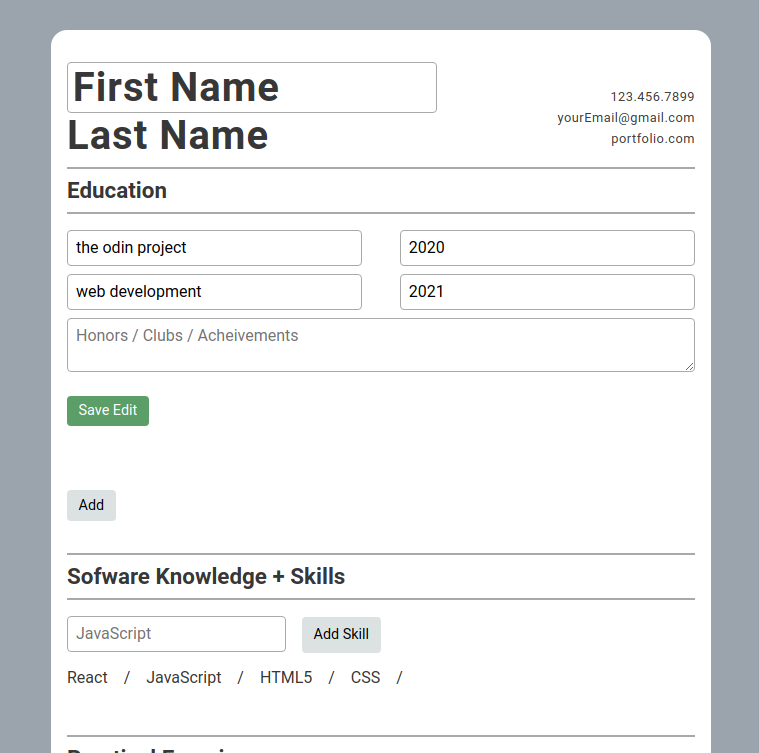

# Resume Builder App
A resume builder built in react. Forms, inputs, inline-editing, it's all there.

Not very polished from a visual standpoint, but the functionality is there. Built as a React learning and no one is actually going to use this.

[Check it](https://jmilll.github.io/cv-application/)

## Example
### Home before adding

###  Add Form

###  Filled out

###  Editing a section

[Check it](https://jmilll.github.io/cv-application/)

## Features

* React
* Add typical resume experience.
* Inline editing.
* Edit existing experience.
* Remove irrelevant or accidentally added experience.

## Motivation

The purpose of this project was to learn and use React.

## Technologies Used

* React
* JavaScript
* HTML / CSS
* Flexbox

## Acknowledgements

This project was inspired by [The Odin Project CV-Project](https://www.theodinproject.com/courses/javascript/lessons/cv-application) online learning curriculum.

## License

MIT

